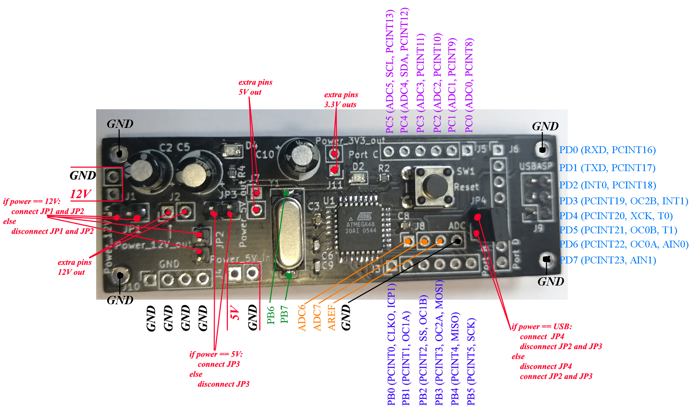
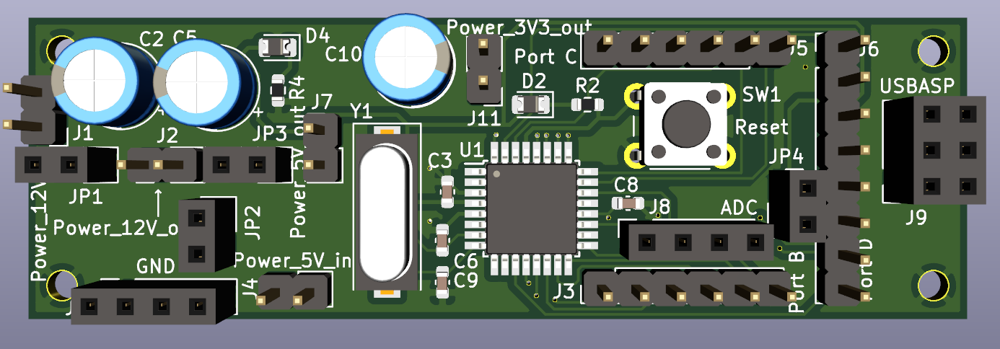
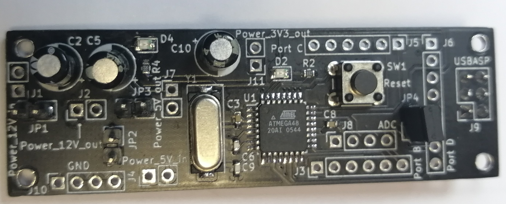
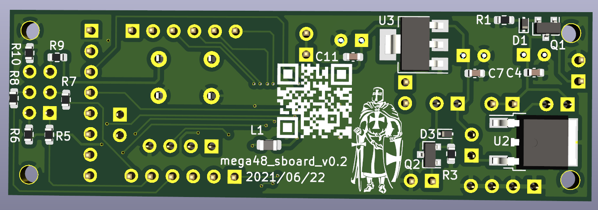
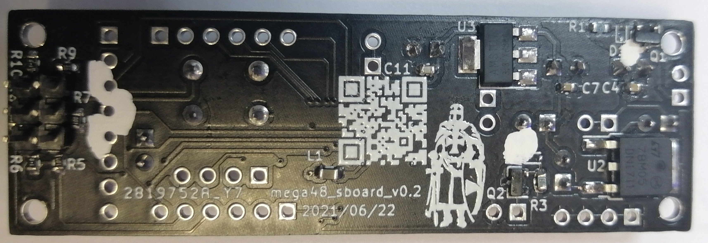

# mega48_super_board  
Development board for Atmega48 developed by me and [mostovsky](https://github.com/mostovsky).  
For version v0.2 go to [this](docs/mega48_super_board_v0.1.md).  

Version 0.2:  
1. Power supply from 7V to 15V or just 5V.  
2. Reverse polarity protection.  
3. There are separate connectors for external power, 5V, 3.3V and ground.  
4. Separate connectors for each pin of the MCU (except reset, xtal and power), compatible with prototyping board.  
5. External quartz at 8 MHz.  
6. Programming via USBasp.  
7. LED to indicate power and reset.  

Board size: 23x71 mm.  
Version 0.2 functional with some errors:  
1. The connector for programming must be soldered on the bottom side so that you can start the USBasp programmer, or solder a new cable for the programmer yourself.  
2. Transistors Q1 and Q2 must be upside-down soldered.  

***
## scheme:  
### scheme_v0.2:  
[pdf](docs/scheme_v0.2.pdf)  

***
## helper:  
### helper_v0.2:  
  

***
## pcb:  
### pcb_v0.2:  
#### top screen:  
  
#### top assambled:  
  
#### bottom screen:  
  
#### bottom assambled:  
  

***
## work:  
### work:  
  
### AVRdude:  
  

***
## gerber:  
Archive for production:  
[gerber_v0.1](https://github.com/piro-s/mega48_super_board/raw/main/gerber/mega48_super_board_v0.1.zip)  
[gerber_v0.2](https://github.com/piro-s/mega48_super_board/raw/main/gerber/mega48_super_board_v0.2.zip)  