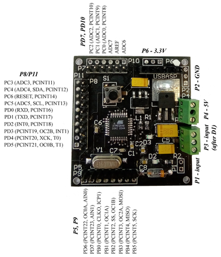
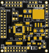
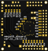
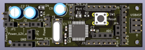
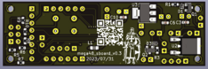
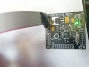
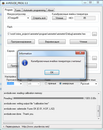

## mega48_super_board  
Development board for Atmega48 developed by me and [mostovsky](https://github.com/mostovsky).  
Description for version v0.1 go to [this](docs/mega48_super_board_v0.1.md).  
Description for version v0.2 (some errors) go to [this](docs/mega48_super_board_v0.2.md).  

---
Version 0.3:  
1. Power supply from 7V to 15V or just 5V.  
2. Reverse polarity protection.  
3. There are separate connectors for external power, 5V, 3.3V and ground.  
4. Separate connectors for each pin of the MCU (except reset, xtal and power), compatible with prototyping board.  
5. External quartz at 8 MHz.  
6. Programming via USBasp.  
7. LED to indicate power and reset.  

Board size: 23x71 mm.  
Version 0.3 is the corrected version 0.2.  

---
#### scheme:  
scheme_v0.1:  
[pdf](docs/scheme_v0.1.pdf)  
scheme_v0.3:  
[pdf](docs/scheme_v0.3.pdf)  

---
#### helper:  
helper_v0.1:  
  
helper_v0.3 (also v0.2):  
  

---
#### pcb:  
##### pcb_v0.1:  
top screen:  
  
bottom_screen:  
  
##### pcb_v0.3:  
top screen:  
  
bottom_screen:  
  

---
#### work:  
  
AVRdude:  
  

---
#### gerber:  
Archive for production:  
[gerber_v0.1](https://github.com/piro-s/mega48_super_board/raw/main/gerber/mega48_super_board_v0.1.zip)  
[gerber_v0.3](https://github.com/piro-s/mega48_super_board/raw/main/gerber/mega48_super_board_v0.3.zip)  