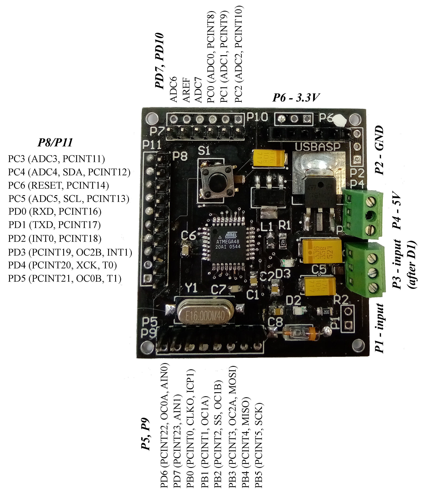
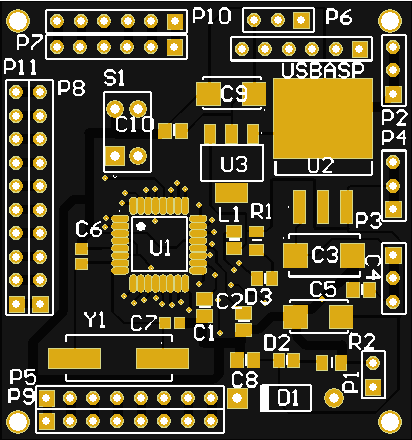
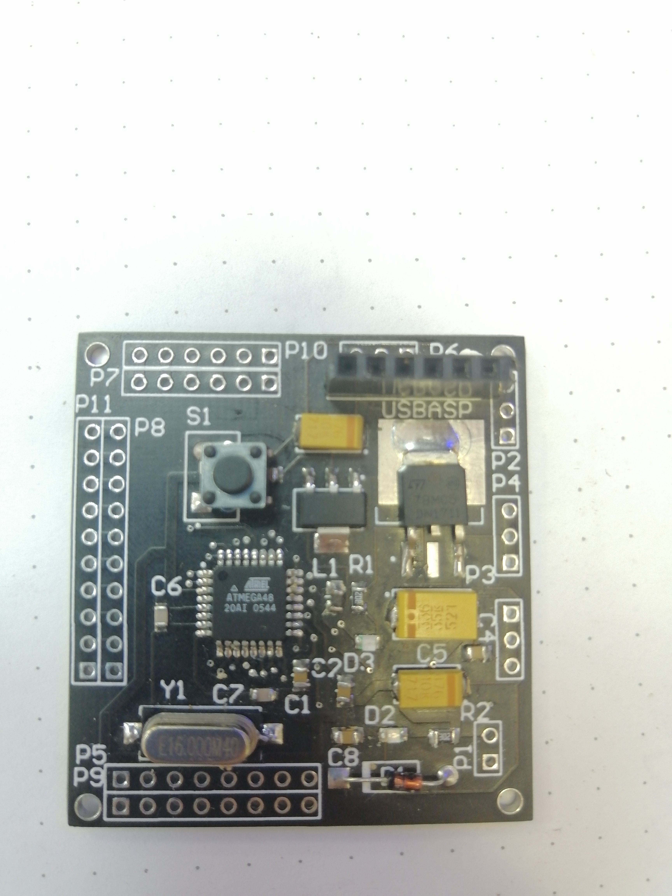
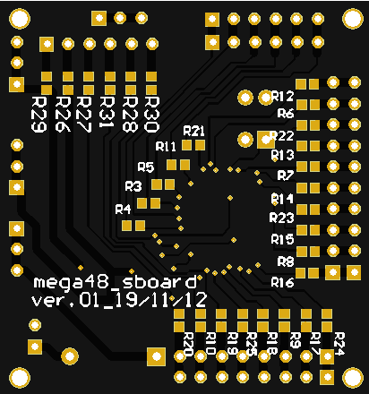
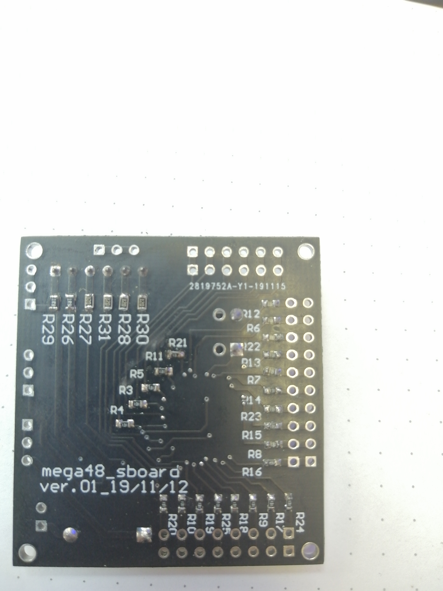
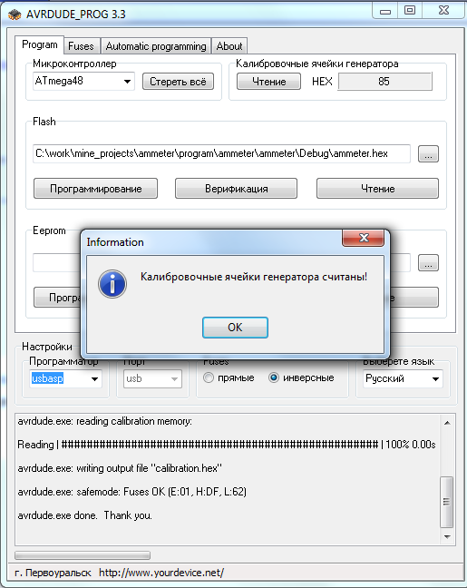

# mega48_super_board
Development board for Atmega48 developed by me and [mostovsky](https://github.com/mostovsky).
Version 0.1 fully functional. Version 0.2 in progress.

***
## scheme:
### scheme:

### helper:

***
## pcb:
### top screen:

### top assambled:

### bottom screen:

### bottom assambled:

***
## work:
### work:

### AVRdude:

***
## gerber:
Archive for production:
[gerber](https://github.com/piro-s/mega48_super_board/raw/main/gerber/mega48_super_board_v0.1.zip)