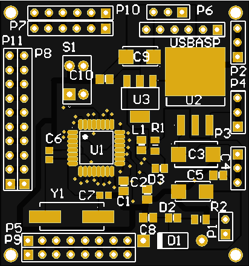
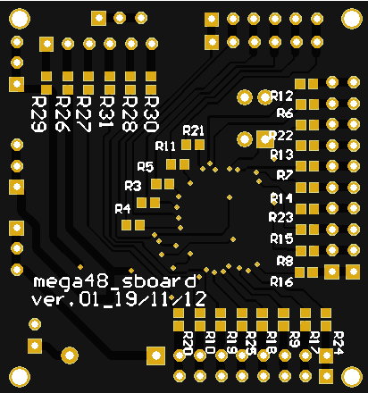
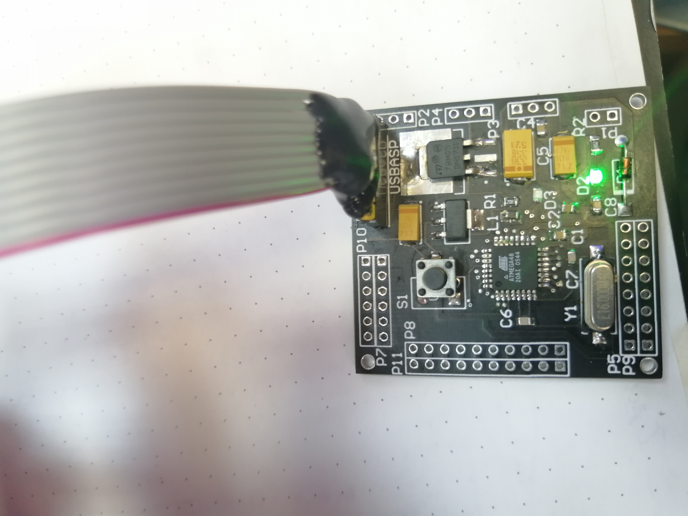

# mega48_super_board  
Development board for Atmega48 developed by me and [mostovsky](https://github.com/mostovsky).  

Version 0.1: 
1. Power supply from 7V to 15V.  
2. There are separate connectors for external power, 5V, 3.3V and ground.  
3. Separate paired connectors for each pin of the MCU (except reset, xtal and power).  
4. Series protection resistors to each output pin.  
5. External quartz at 8 MHz.  
6. Programming via USBasp.  
7. LED to indicate power and reset.  

Version v0.1 fully functional. Board size: 48x45 mm.  

***
## scheme:  
### scheme_v0.1:  
[pdf](scheme_v0.1.pdf)  

***
## helper:  
### helper_v0.1:  
  

***
## pcb:  
### pcb_v0.1:  
#### top screen:  
  
#### top assambled:  
  
#### bottom screen:  
  
#### bottom assambled:  
  

***
## work:  
### work:  
  
### AVRdude:  
  

***
## gerber:  
Archive for production:  
[gerber_v0.1](https://github.com/piro-s/mega48_super_board/raw/main/gerber/mega48_super_board_v0.1.zip)  